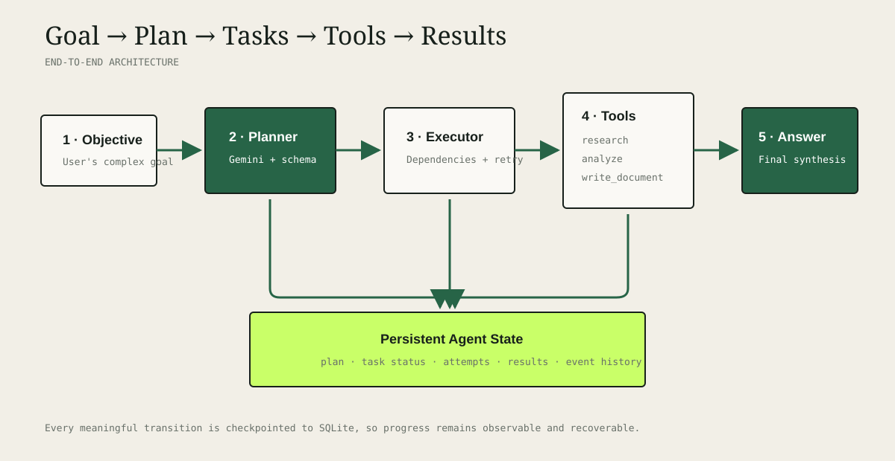
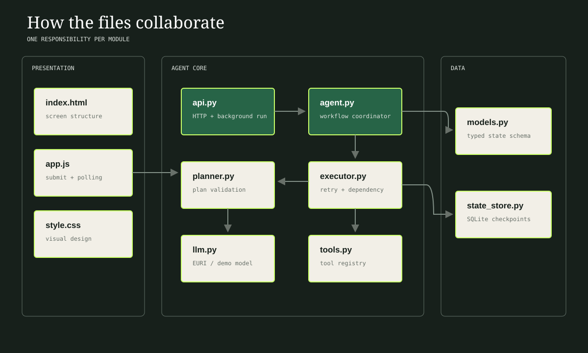
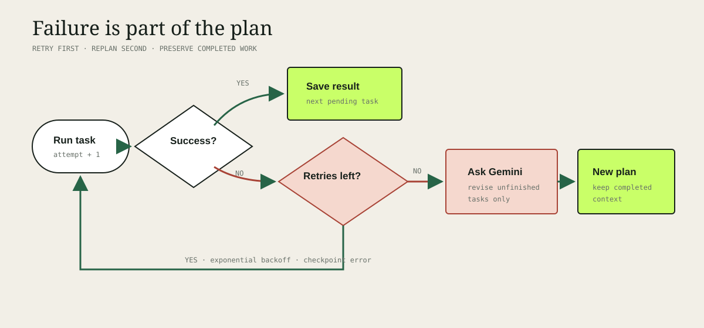

# Atlas — EURI Planning Agent

Atlas converts a complex objective into a validated sequence of executable tasks, selects a tool for each task, runs them in dependency order, stores progress, and recovers from failure.

The codebase is documented at three levels: every Python module explains its responsibility,
classes describe the state or service they represent, and methods/functions document their
inputs, outputs, and important errors. The browser client uses equivalent JSDoc comments.



## What the project demonstrates

The visible workflow is:

`Goal → Plan → Tasks → Tool Selection → Execution → Results → Final Response`

- **Planning:** EURI returns JSON that is validated as a typed `PlanDraft`.
- **State management:** the goal, plan, task status, attempts, results, errors, and event log are saved in SQLite after every transition.
- **Tool selection:** each planned task explicitly selects `research`, `analyze`, or `write_document`.
- **Execution:** tasks run only after their dependencies have completed.
- **Failure handling:** a failed tool call is retried with exponential backoff. After retries are exhausted, EURI revises the unfinished plan while completed results are preserved.
- **Demo mode:** the full workflow runs without an API key, which is useful during a classroom presentation and in tests.

## Quick start

Prerequisite: Python 3.11 or newer. From the project directory, create a virtual
environment and install the development dependencies:

```bash
python3 -m venv .venv
source .venv/bin/activate          # Windows: .venv\Scripts\activate
python -m pip install -r requirements-dev.txt
```

Start in demo mode first. Demo mode does not require an API key or make external
model calls:

```bash
DEMO_MODE=true python -m uvicorn app.api:app --reload
```

Open <http://127.0.0.1:8000>. Interactive API documentation is available at
<http://127.0.0.1:8000/docs>. Stop the server with `Ctrl+C`.

### Run with EURI

To use live model execution through EURI, create a `.env` file in the project root:

```dotenv
EURI_API_KEY=your_euri_api_key_here
EURI_BASE_URL=https://api.euron.one/api/v1/euri
EURI_MODEL=gemini-3.5-flash-lite
DEMO_MODE=false
```

Then start the application normally:

```bash
python -m uvicorn app.api:app --reload
```

Run the automated tests with:

```bash
python -m pytest -q
```

Try this objective:

> Research three AI companies, compare their products, and prepare a summary.

## Application flow

1. The browser sends the objective to `POST /api/runs`.
2. The API immediately returns a run ID and starts the agent in the background.
3. The planner asks EURI for JSON tasks and validates their schema, IDs, and dependencies.
4. The executor resolves dependencies and sends each task to its selected tool.
5. The state store checkpoints status and results after every step.
6. The browser polls `GET /api/runs/{run_id}` and renders live progress.
7. EURI synthesizes the successful task results into the final response.



## File guide

| File | Responsibility | Receives → Produces |
|---|---|---|
| `app/api.py` | FastAPI routes and background runs | HTTP objective → run ID/state |
| `app/agent.py` | Orchestrates the complete lifecycle | objective → completed agent state |
| `app/planner.py` | Creates/revises and validates plans | objective/failure → valid plan |
| `app/llm.py` | EURI OpenAI-compatible adapter and deterministic demo adapter | prompts → plan/text |
| `app/executor.py` | Runs dependencies, retries, and raises failures | tasks → task results |
| `app/tools.py` | Tool registry for research, analysis, and writing | selected tool + context → result |
| `app/models.py` | Pydantic schemas and status enums | raw values → typed state |
| `app/state_store.py` | Durable SQLite checkpoints | `AgentState` ↔ JSON row |
| `app/static/*` | Student-facing interface and polling | browser events ↔ API |
| `tests/*` | Unit and integration verification | controlled inputs → assertions |

## Code documentation guide

The main execution path is intentionally split into small, documented components:

- `PlanningAgent.run()` owns the complete lifecycle and converts unexpected exceptions into a persisted failed state.
- `Planner.create()` and `Planner.revise()` request plans, while `Planner.validate()` enforces task counts, unique IDs, and dependency order.
- `Executor.run()` executes unfinished tasks, checkpoints each transition, and raises `TaskFailed` after dependencies or retries are exhausted.
- `ToolRegistry.execute()` allows only registered tools; its tool methods research, analyze prior results, or write a sanitized Markdown file.
- `StateStore` saves and restores complete `AgentState` snapshots in SQLite.
- `ModelProvider` defines the model contract implemented by live EURI and deterministic demo providers.

You can inspect documentation interactively from Python, for example:

```bash
python -c "from app.agent import PlanningAgent; help(PlanningAgent.run)"
```

## Failure recovery



A task gets `MAX_RETRIES + 1` total attempts. Each error is recorded in the event timeline. When all attempts fail, the top-level agent changes to `replanning` and sends EURI the objective, successful results, failed task, and error. The revised tasks then execute. `MAX_REPLANS` prevents an infinite loop.

## API

| Method | Endpoint | Purpose |
|---|---|---|
| `GET` | `/api/health` | Show model and current mode |
| `POST` | `/api/runs` | Start an agent run |
| `GET` | `/api/runs/{run_id}` | Read current plan and execution state |
| `GET` | `/api/runs` | List recent runs |

Example:

```bash
curl -X POST http://127.0.0.1:8000/api/runs \
  -H 'Content-Type: application/json' \
  -d '{"objective":"Research three AI companies, compare their products and prepare a summary."}'
```

## Run tests

```bash
pytest -q
```

The tests cover plan validation, state persistence, successful execution, retries, and replanning. No EURI key is needed.

## Security and limits

- Secrets come from environment variables and `.env` is ignored by Git.
- Output filenames are sanitized and restricted to `outputs/`.
- The model can choose only registered tools; it cannot execute arbitrary shell commands.
- Search-grounded output can still contain mistakes. Check important claims and source links.
- This is a single-process teaching project. A production deployment should use a job queue and a managed database.

## Submission checklist

- Push this repository to GitHub without `.env` or `data/*.db`.
- Record the walkthrough using [docs/VIDEO_SCRIPT.md](docs/VIDEO_SCRIPT.md).
- Show one live EURI run and one failure/retry test.
- Put the GitHub and unlisted YouTube links in the submission form.

Detailed acceptance criteria are in [docs/REQUIREMENTS.md](docs/REQUIREMENTS.md).

## EURI implementation reference

This project uses the `openai` Python SDK with EURI's OpenAI-compatible base URL. Plan responses are requested as JSON and validated with Pydantic before execution. Research output should still be verified because the provider may not have live search access.
